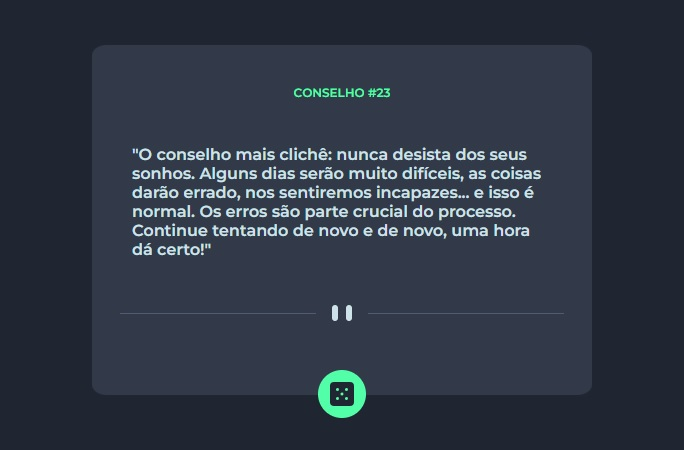

# Exercício de JavaScript Avançado

Exercício proposto no curso DevQuest, dos irmãos Ricardo e Roberto (<a href="https://www.instagram.com/devemdobro" target="_blank">@devemdobro</a>), baseado em um desafio do <a href="https://www.frontendmentor.io/" target="_blank">Frontend Mentor</a>.

## Screenshot do exercício

:game_die: É possível gerar outros conselhos clicando no botão de dado.

## Tecnologias utilizadas

- HTML
- CSS
- JavaScript

## Desafios
Certamente a aplicação do JavaScript, principalmente por ser a primeira vez que interajo com uma API.

## Coisas que aprendi
- Utilizar o fetch;
- Interagir com APIs;
- Trabalhar com promises.

## Futuro do projeto
- Melhorar a semântica do HTML;
- Melhorar o CSS;
- Refatorar o código;
