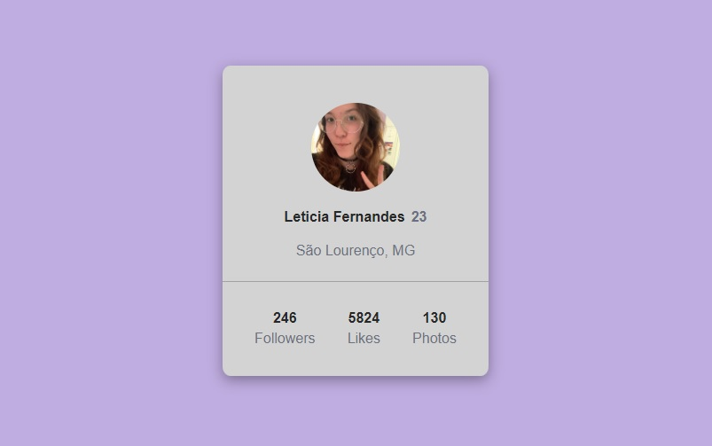

# Projeto Card de Perfil

Projeto proposto no curso DevQuest, dos irmãos Ricardo e Roberto (<a href="https://www.instagram.com/devemdobro" target="_blank">@devemdobro</a>), baseado em um desafio do <a href="https://www.frontendmentor.io/" target="_blank">Frontend Mentor</a>.

## Screenshot do projeto

## Tecnologias utilizadas

- HTML
- CSS

## Desafios
O maior desafio foi o posicionamento dos elementos utilizando os conceitos de display flex e position, que ainda são novos para mim.

## Coisas que aprendi
- Posicionar elementos utilizando o display flex e o position;
- Trabalhar com variáveis no CSS;
- Fazer um site responsivo para dispositivos de telas menores.

## Futuro do projeto
- Melhorar a semântica do HTML;
- Refatorar o código.
